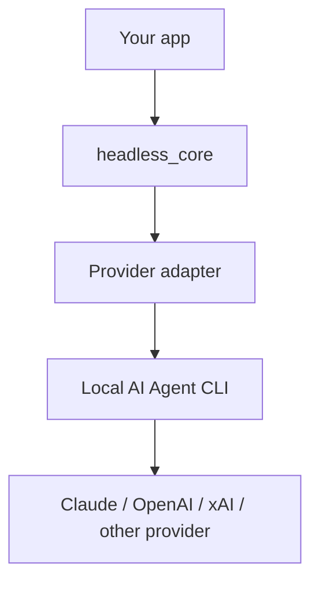

# headless_core

AI Agent CLI を Node.js から headless mode で実行するためのコアライブラリです。

Claude Code、Codex、Grok、Agy などのローカル CLI を、同じ `run()` API、進捗イベント、fallback hook、モデル選択の仕組みで扱えます。

## Features

- Claude Code / Codex / Grok / Agy の CLI 実行
- TypeScript API
- `stdout` / `stderr` の途中出力を `onProgress` で通知
- `timeoutMs` と `AbortSignal` による停止
- provider 別の model / reasoning effort option 変換
- 失敗分類と fallback hook
- 共有 `models.json` によるモデル候補管理
- `headless-core models init|inspect` CLI

## Demo

最小チャット UI のサンプルがあります。

```sh
npm run example
```

起動後、ブラウザで開きます。

```txt
http://127.0.0.1:4173
```

詳細は [example/README.md](./example/README.md) を参照してください。

## Installation

```sh
npm install @headless-core/core
```

ローカル開発で試す場合:

```sh
npm install
npm run build
```

## Quick Start

```ts
import { createHeadlessCore } from "@headless-core/core";

const headless = createHeadlessCore({
  cwd: process.cwd(),
  timeoutMs: 120_000
});

const output = await headless.run({
  agent: {
    provider: "codex",
    model: "default",
    reasoningEffort: "medium"
  },
  prompt: "Say hello in one line."
});

console.log(output);
```

実行例:

```txt
Hello.
```

`model: "default"` を指定した場合、provider CLI には `--model` を渡しません。

## How It Works



`headless_core` は API proxy ではありません。利用者のローカル環境にある AI Agent CLI を `spawn` で起動し、出力と終了状態を扱います。

## API

### `createHeadlessCore(config?)`

```ts
const headless = createHeadlessCore({
  cwd: "/path/to/project",
  timeoutMs: 120_000,
  env: process.env
});
```

### `headless.run(options)`

```ts
const output = await headless.run({
  agent: { provider: "claude", model: "opus", reasoningEffort: "high" },
  prompt: "Summarize this project.",
  onProgress(event) {
    console.log(event.state, event.partialOutput ?? event.message);
  },
  onFallback({ error, prompt }) {
    if (error.kind === "rate_limit") {
      return {
        type: "rerun",
        agent: { provider: "codex", model: "default" },
        prompt
      };
    }

    return { type: "fail" };
  }
});
```

### `getAvailableModels(options)`

```ts
import { getAvailableModels } from "@headless-core/core";

const models = await getAvailableModels({ agent: "codex" });
```

### `getAvailableReasoningEffortOptions(options)`

```ts
import { getAvailableReasoningEffortOptions } from "@headless-core/core";

const efforts = getAvailableReasoningEffortOptions({ agent: "claude" });
```

## Options

### `createHeadlessCore`

| option | description |
| --- | --- |
| `cwd` | Agent CLI を実行する作業ディレクトリ |
| `timeoutMs` | デフォルトの実行 timeout。未指定時は 120 秒 |
| `env` | Agent CLI に渡す環境変数 |

### `run`

| option | description |
| --- | --- |
| `agent.provider` | `codex`、`claude`、`grok`、`agy` |
| `agent.model` | provider に渡す model id。`default` の場合は `--model` を渡さない |
| `agent.reasoningEffort` | provider に渡す reasoning effort。`default` の場合は渡さない |
| `prompt` | Agent CLI に渡す指示 |
| `onProgress` | 状態変化と途中出力の callback |
| `onFallback` | 失敗時の fallback callback |
| `signal` | 実行を中断する `AbortSignal` |
| `timeoutMs` | この実行だけの timeout |

## Supported Agents

| agent | binary | model option | reasoning effort |
| --- | --- | --- | --- |
| Codex | `codex` or `CODEX_BIN` | `--model` | `--config model_reasoning_effort="..."` |
| Claude Code | `claude` or `CLAUDE_BIN` | `--model` | `--effort` |
| Grok | `grok` or `GROK_BIN` | `--model` | 未対応 |
| Agy | `agy` or `AGY_BIN` | `--model` | 未対応 |

## Models Config

モデル候補は共有設定ファイルから読みます。

```txt
~/.config/headless-core/models.json
```

別のパスを使う場合:

```sh
HEADLESS_CORE_MODELS_PATH=./example/models.json npm run example
```

初期化:

```sh
headless-core models init
```

現在の環境から候補を確認:

```sh
headless-core models inspect
```

`inspect` は JSON を stdout に出力します。設定ファイルは上書きしません。

## CLI

```sh
headless-core models init
headless-core models inspect
```

## Examples

- [example/README.md](./example/README.md): model selector 付きの最小チャット UI
- [example/app.js](./example/app.js): ブラウザ側 UI
- [example/server.mjs](./example/server.mjs): Node.js server からの実行例
- [example/models.sample.json](./example/models.sample.json): models config サンプル

## Requirements

- Node.js 20+
- 利用する Agent CLI がローカル環境にインストール済みであること
- macOS / Linux 推奨
- Windows は未検証

## Limitations

- 会話履歴管理、DB 永続化、Web API server は含みません
- retry は自動では行いません。必要な場合は `onFallback` で実装します
- provider 固有の認証、課金、rate limit は各 CLI の設定に依存します
- Agent CLI がローカルファイルを読み書きする可能性があります
- prompt、途中出力、最終結果、エラー内容が application log に残る可能性があります

## Security

`headless_core` はローカルの AI Agent CLI を実行します。本番利用では次を検討してください。

- `cwd` を必要最小限のディレクトリにする
- secret、API key、個人情報を prompt や log に含めない
- 信頼できない入力を prompt に含める場合は prompt injection を前提に扱う
- 書き込みを伴うタスクでは Git などで実行前の状態を保存する
- timeout / abort / fallback 後の後処理を application 側で定義する

## Development

```sh
npm install
npm run build
npm test
```

すべて確認する場合:

```sh
npm run check
```

## Project Structure

```txt
src/      TypeScript source
test/     Vitest tests
example/  Local demo app
docs/     Design notes and references
```

## License

MIT. See [LICENSE](./LICENSE).
