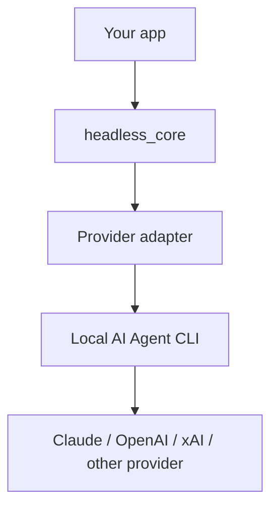

# headless_core

AI Agent CLI を Node.js から headless mode で実行するためのコアライブラリです。

Claude Code、Codex、Grok、Agy、Devin などのローカル CLI を、同じ `run()` API、進捗イベント、fallback hook、モデル選択の仕組みで扱えます。

## Features

- Claude Code / Codex / Grok / Agy / Devin の CLI 実行
- TypeScript API
- `stdout` / `stderr` の途中出力を `onProgress` で通知
- `timeoutMs` と `AbortSignal` による停止
- provider 別の model / reasoning effort option 変換
- 失敗分類と fallback hook
- 共有 `models.json` によるモデル候補管理
- `headless-core models init|inspect` CLI

## Demo

最小チャット UI のサンプルがあります。

```sh
npm run example
```

起動後、ブラウザで開きます。

```txt
http://127.0.0.1:4173
```

`PORT` / `HOST` 環境変数で変更できます。ポートが使用中の場合は自動で次のポートを試します(最大20ポート)。

詳細は [example/README.md](./example/README.md) を参照してください。

## Installation

npm の [@headless-core/core](https://www.npmjs.com/package/@headless-core/core) からインストールできます。

```sh
npm install @headless-core/core
```

ローカル開発で試す場合:

```sh
npm install
npm run build
```

## Quick Start

```ts
import { createHeadlessCore } from "@headless-core/core";

const headless = createHeadlessCore({
  cwd: process.cwd(),
  timeoutMs: 120_000
});

const output = await headless.run({
  agent: {
    provider: "codex",
    model: "default",
    reasoningEffort: "medium"
  },
  prompt: "Say hello in one line."
});

console.log(output);
```

実行例:

```txt
Hello.
```

`model: "default"` を指定した場合、provider CLI には `--model` を渡しません。

## How It Works


```mermaid
flowchart TD
  App[Your app] --> SDK[headless_core]
  SDK --> Adapter[Provider adapter]
  Adapter --> CLI[Local AI Agent CLI]
  CLI --> Provider[Claude / OpenAI / xAI / other provider]
```

`headless_core` は API proxy ではありません。利用者のローカル環境にある AI Agent CLI を `spawn` で起動し、出力と終了状態を扱います。

## API

### `createHeadlessCore(config?)`

```ts
const headless = createHeadlessCore({
  cwd: "/path/to/project",
  timeoutMs: 120_000,
  env: process.env
});
```

### `headless.run(options)`

```ts
const output = await headless.run({
  agent: { provider: "claude", model: "opus", reasoningEffort: "high" },
  prompt: "Summarize this project.",
  onProgress(event) {
    console.log(event.state, event.partialOutput ?? event.message);
  },
  onFallback({ error, prompt }) {
    if (error.kind === "rate_limit") {
      return {
        type: "rerun",
        agent: { provider: "codex", model: "default" },
        prompt
      };
    }

    return { type: "fail" };
  }
});
```

### `getAvailableModels(options)`

```ts
import { getAvailableModels } from "@headless-core/core";

const models = await getAvailableModels({ agent: "codex" });
```

### `getAvailableReasoningEffortOptions(options)`

```ts
import { getAvailableReasoningEffortOptions } from "@headless-core/core";

const efforts = getAvailableReasoningEffortOptions({ agent: "claude" });
```

### `headless.createSession(options)`

```ts
const session = await headless.createSession({
  agent: { provider: "codex", transport: "app-server", model: "default" }
});
```

### `headless.shutdown()`

この core が保持する全 session を閉じ、常駐 agent process を全て終了します。

## Persistent sessions

`run()` は呼び出しごとに新しい CLI プロセスを spawn します（transport `cli`、デフォルト）。起動オーバーヘッドを減らし会話を継続したい場合は、`createSession()` が常駐 agent プロセスを維持し、複数回の `session.run()` で再利用します。

| provider | `transport` | 常駐プロセス |
| --- | --- | --- |
| `codex` | `app-server` | `codex app-server`（stdio 上の JSON-RPC） |
| `agy` | `acp` | `agy_acp_server`（stdio 上の Agent Client Protocol） |
| `devin` | `acp` | `devin acp`（stdio 上の Agent Client Protocol） |
| 任意 | `cli`（デフォルト） | `run()` ごとの one-shot spawn |

同一の provider / transport / binary を使う session は 1 つの OS プロセスを共有し、各 session は独立した会話（codex では thread、agy / devin では ACP session）を持ちます。同一 session への `run()` は直列化され、別 session 同士は並行実行できます。最後の session が `close()` されるとプロセスは終了します。

```ts
const session = await headless.createSession({
  agent: { provider: "codex", transport: "app-server" }
});

await session.run({
  prompt: "Hello",
  onProgress(event) {
    console.log(event.state, event.partialOutput);
  }
});
await session.run({ prompt: "同じ thread で追撃" });

// プロセスは維持したまま新しい会話へ:
await session.reset();

// プロセス再起動なしのモデル一覧取得・切替:
const models = await session.getAvailableModels();
await session.setModel("MODEL_ID", "low");

await session.close();

// Devin / Agy も同じ API（ACP 経由: `devin acp` / `agy_acp_server`）:
const devin = await headless.createSession({
  agent: { provider: "devin", transport: "acp" }
});
await devin.run({ prompt: "Hello" });
await devin.close();

const agy = await headless.createSession({
  agent: { provider: "agy", transport: "acp" }
});
await agy.run({ prompt: "Hello" });
await agy.close();

// この core が持つ常駐プロセスを全て終了:
await headless.shutdown();
```

`session.run()` は `prompt`、`signal`（`AbortSignal`）、`timeoutMs`、`onProgress` を受け付け、`headless.run()` と同じ progress event を返します。abort / timeout はリモート側の turn をキャンセルするため（`turn/interrupt` / `session/cancel`）、session は再利用可能なままです。権限 posture は各 provider の CLI 経路と同等です: codex の thread は `sandbox: "read-only"` + `approvalPolicy: "never"` で動き（approval request は自動で拒否）、devin session は回答専用の `ask` モードを選択し permission request はデフォルトで拒否、agy session は server が提示する中で最も強い編集 mode（`accept-edits` / `auto_edit` / `yolo` — build ごとに名称が異なる）を選択し、permission request を自動承認します（`agy --print --dangerously-skip-permissions` と同等）。

agy の `acp` transport は `agy` CLI ではなく、独立バイナリの `agy_acp_server`（ACP レジストリの `antigravity-acp`）を起動します。`AGY_ACP_BIN`、または PATH 上の `agy_acp_server` / `agy_acp_server.par`（Windows は `agy_acp_server.exe`）から解決されます。model と reasoning effort は session の ACP config option 経由で適用されます: level 埋め込み variant id（`gemini-3-8-flash-low`）が advertise されていればそれを選択し、それ以外の flag 範囲内の level は session の effort 系 option（`effort`、`thought_level` など）へ送ります。

#### `agy_acp_server` のインストール

`acp` transport には Google Antigravity 公式の ACP server が必要です。[ACP レジストリ](https://github.com/agentclientprotocol/registry/blob/main/antigravity-acp/agent.json)（registry id `antigravity-acp`、binary `agy_acp_server.par`。Windows は `agy_acp_server.exe`）で配布されています。最新バージョンと各 platform のダウンロード URL はレジストリを確認してください。以下は [setup wiki](https://github.com/taiyop/headless_core/wiki/Antigravity-ACP-Server-(agy_acp_server)-%E3%81%AE%E3%82%BB%E3%83%83%E3%83%88%E3%82%A2%E3%83%83%E3%83%97) の手順に沿った macOS での例です:

```sh
mkdir -p ~/.local/share/antigravity-acp && cd ~/.local/share/antigravity-acp
uname -m   # arm64（Apple Silicon）または x86_64（Intel）
curl -L -o agy-acp.zip \
  https://dl.google.com/agy-extensions/releases/macos/agy-acp-server-1.2.1-darwin-arm64.zip
# Intel Mac は ...-darwin-x86_64.zip。Linux / Windows はレジストリ参照
unzip agy-acp.zip && chmod +x agy_acp_server.par
xattr -cr ~/.local/share/antigravity-acp   # Gatekeeper にブロックされた場合のみ
```

その後、`AGY_ACP_BIN=~/.local/share/antigravity-acp/agy_acp_server.par` を設定するか、symlink で PATH に置きます:

```sh
mkdir -p ~/.local/bin
ln -s ~/.local/share/antigravity-acp/agy_acp_server.par ~/.local/bin/agy_acp_server
```

server は `~/.gemini/` 配下の Antigravity credential（Antigravity app / `agy` CLI と共通）で Google アカウント認証を行います。先にそちらでサインインしておけば、`initialize` / `session/new` は非対話で通ります。

devin の ACP session では、`model` config option が thinking level 埋め込みの variant uid（`swe-2-high`、`claude-opus-5-5-medium`）を提示する一方、`models.json` には通常 family slug（`swe-2`、`claude-opus-5.5`）が入ります。`setModel()` / session 作成時は、effort 合成 uid（`claude-opus-5.5` + `high` → `claude-opus-5-5-high`）→ 完全一致 / dashed 化した id → family が提示する唯一の variant（`swe-2` → `swe-2-high`、`gpt-6-astra` → `gpt-6-astra-medium`）の順に解決します。残った effort は session が `thought_level` config option を持つ場合にそこへ適用します。`default` を渡すと session 開始時の model / thought level に戻ります。

## Reasoning effort

`agent.reasoningEffort` は全 provider 共通の語彙を受け付けます:

```ts
type Effort = "default" | "none" | "minimal" | "low" | "medium" | "high" | "xhigh" | "max";
```

各値は互換ではありません:

- `default` — effort を明示指定しない。provider / CLI / model のデフォルトが使われます。`reasoningEffort` 未指定と同じ挙動です。
- `none` — reasoning / thinking を完全に無効化します。`minimal` とは別物で、model が本当の OFF（advertise された `none` level や non-thinking variant）を持つ場合のみ有効です。`minimal` / `low` への暗黙変換は行いません。
- `minimal` — reasoning を OFF にせず動く最小 level で、「OFF」ではありません。
- `low` / `medium` / `high` / `xhigh` / `max` — 対応範囲内で段階的な effort。

各 adapter は level を provider 固有の仕組みに変換し、リクエスト送信**前**に model capability に照らして検証します（capability は `codex debug models`、app-server `model/list`、`devin models list`、ACP config option、`agy models` など runtime から取得）。非対応の値は `EffortError` になります:

- `INVALID_EFFORT` — 語彙外の値（例: `"banana"`）。
- `UNSUPPORTED_EFFORT` — 値は有効だが選択した model が表現できない。エラーメッセージに model の supported efforts を列挙し、暗黙のフォールバックは行いません。

provider 別の変換:

| provider | 仕組み | 備考 |
| --- | --- | --- |
| Codex | `model_reasoning_effort`（CLI `-c` / app-server `turn/start` の `effort`） | level はそのまま透過。`supported_reasoning_levels` / `supportedReasoningEfforts` で model ごとの対応を検証。`default` はパラメータ自体を送らない |
| Claude Code | `--effort` | `low`, `medium`, `high`, `xhigh`, `max` |
| Grok | `--effort` | `low`, `medium`, `high` |
| Agy（Gemini 系） | level 埋め込み variant id（`--model gemini-3-8-flash-low`）または `--effort` | 要求 level を持つ variant が優先。`none` は明示的な non-thinking variant（`gemini-2-5-flash-none`）にのみマップし、`minimal` へは変換しない。それ以外の flag 範囲内の level は `--effort low|medium|high` |
| Devin | variant uid（`--model <model>-<level>`）または ACP `thought_level` | `none` は明示的な non-reasoning variant（`gpt-5-4-none`、または thinking variant と並ぶ level 無しの sibling）にのみマップ — 機械的な `<model>-none` は生成しない。その他の level も advertised variant か `thought_level` に一致する必要がある |

capability を取得できなかった場合、codex / agy は provider 側の検証に委譲します。devin の `none` は advertise された variant のみが担えるため、catalog 無しでは常に reject します。

### transport ごとの capability 差異（devin）

devin の capability は transport ごとに読み取られ、両者は一致しないことがあります:

- `cli` — `devin models list` が全 variant uid を提示します（`gpt-6-luna-none`、`gpt-5-4-none` など non-thinking variant を含む）。
- `acp` — session の `model` config option は**精選された subset**（例: `gpt-6-luna-medium` のみ）しか提示せず、`session/set_config_option` はその一覧外の値を拒否します（`Invalid value ... for config option 'model'`）。

そのため、`cli` では使える effort が `acp` では非対応になりえます: `gpt-6-luna` + `none` は `cli` では `gpt-6-luna-none` に解決されますが、`acp` では session がその variant を提示していないため `UNSUPPORTED_EFFORT` になります。エラーの `supportedEfforts` は常に選択した transport の実際の選択肢を反映します。

## Options

### `createHeadlessCore`

| option | description |
| --- | --- |
| `cwd` | Agent CLI を実行する作業ディレクトリ |
| `timeoutMs` | デフォルトの実行 timeout。未指定時は 120 秒 |
| `env` | Agent CLI に渡す環境変数 |

### `run`

| option | description |
| --- | --- |
| `agent.provider` | `codex`、`claude`、`grok`、`agy`、`devin` |
| `agent.transport` | `cli`（デフォルト）、`app-server`（codex）、`acp`（agy、devin）。Persistent sessions 参照 |
| `agent.model` | provider に渡す model id。`default` の場合は `--model` を渡さない |
| `agent.reasoningEffort` | 共通 effort 語彙（`default`, `none`, `minimal`, `low`, `medium`, `high`, `xhigh`, `max`）。`default` / 未指定は effort を送らない。非対応値は `EffortError`。Reasoning effort 参照 |
| `prompt` | Agent CLI に渡す指示 |
| `onProgress` | 状態変化と途中出力の callback |
| `onFallback` | 失敗時の fallback callback |
| `signal` | 実行を中断する `AbortSignal` |
| `timeoutMs` | この実行だけの timeout |

## Supported Agents

| agent | binary | model option | reasoning effort |
| --- | --- | --- | --- |
| Codex | `codex` or `CODEX_BIN` | `--model` | `--config model_reasoning_effort="..."` |
| Claude Code | `claude` or `CLAUDE_BIN` | `--model` | `--effort` |
| Grok | `grok` or `GROK_BIN` | `--model` | `--effort` |
| Agy | `agy` or `AGY_BIN`（cli）; `agy_acp_server` or `AGY_ACP_BIN`（acp） | `--model` | level 埋め込み variant id が優先（`gemini-3-8-flash-low`）、それ以外は `--effort low|medium|high`（cli）または ACP effort config option（acp）。`none` は advertise された non-thinking variant が必要 |
| Devin | `devin` or `DEVIN_BIN` | `--model` | model uid に折り畳む: `model` + effort は `--model <model>-<effort>` になる（例: `claude-opus-5` + `high` -> `claude-opus-5-high`）。model の明示指定が必要。advertise された variant のみ使用 — `none` は明示的な non-reasoning variant にマップ、無ければエラー |

### Headless 時のツール / 権限

| agent | Headless 時の挙動 |
| --- | --- |
| Codex | `--sandbox read-only`（ファイル書き込み不可） |
| Claude Code | `--tools ""`（ツール無効・テキスト入出力のみ） |
| Agy | 非対話の `--print` でもツール実行とファイル書き込み（画像生成など）ができるよう、`--dangerously-skip-permissions` と `--mode accept-edits` を付与する。`--print-timeout` は実行の `timeoutMs` に合わせる。ツールがそれでも自動拒否された場合、Agy は stdout 空のまま exit 0 で stderr に通知を出すことがあり、そのときは失敗として扱う。`acp` transport でも同じ posture を維持する: session は編集可能な mode（`accept-edits` / `auto_edit` / `yolo`）を選択し、`session/request_permission` は自動承認される。 |
| Grok | 特別な sandbox フラグなし |
| Devin | `--print --respect-workspace-trust false --permission-mode auto`（read-only ツールのみ自動承認・ファイル書き込み不可）。prompt は `--` の後に渡す |

## Models Config

モデル候補は共有設定ファイルから読みます。

```txt
~/.config/headless-core/models.json
```

別のパスを使う場合:

```sh
HEADLESS_CORE_MODELS_PATH=./example/models.json npm run example
```

初期化:

```sh
headless-core models init
```

現在の環境から候補を確認:

```sh
headless-core models inspect
```

`inspect` は JSON を stdout に出力します。設定ファイルは上書きしません。

## CLI

```sh
headless-core models init
headless-core models inspect
```

ソースチェックアウトから実行する場合は、先にビルドして `dist/cli.js` を直接呼びます(`headless-core` bin はここを指します):

```sh
npm run build                          # bin は dist/cli.js を指すので先にビルド必須
node dist/cli.js models inspect        # 全プロバイダーを inspect して JSON を stdout に出力
```

## Examples

- [example/README.md](./example/README.md): model selector 付きの最小チャット UI
- [example/app.js](./example/app.js): ブラウザ側 UI
- [example/server.mjs](./example/server.mjs): Node.js server からの実行例
- [example/models.sample.json](./example/models.sample.json): models config サンプル

## Requirements

- Node.js 20+
- 利用する Agent CLI がローカル環境にインストール済みであること
- agy の `acp` transport を使う場合は、公式の `agy_acp_server` バイナリが別途必要（[インストール手順](#agy_acp_server-のインストール)）
- macOS / Linux 推奨
- Windows は未検証

## Limitations

- DB 永続化や Web API server は含みません。session の会話は agent プロセス内にのみ存在し、`reset()` / `close()` / プロセス終了で破棄されます
- retry は自動では行いません。必要な場合は `onFallback` で実装します
- provider 固有の認証、課金、rate limit は各 CLI の設定に依存します
- Agent CLI がローカルファイルを読み書きする可能性があります
- prompt、途中出力、最終結果、エラー内容が application log に残る可能性があります

## Security

`headless_core` はローカルの AI Agent CLI を実行します。本番利用では次を検討してください。

- `cwd` を必要最小限のディレクトリにする
- secret、API key、個人情報を prompt や log に含めない
- 信頼できない入力を prompt に含める場合は prompt injection を前提に扱う
- 書き込みを伴うタスクでは Git などで実行前の状態を保存する
- timeout / abort / fallback 後の後処理を application 側で定義する

## Development

```sh
npm install
npm run build
npm test
```

すべて確認する場合:

```sh
npm run check
```

## Project Structure

```txt
src/      TypeScript source
test/     Vitest tests
example/  Local demo app
docs/     Design notes and references
```

## License

MIT. See [LICENSE](./LICENSE).
