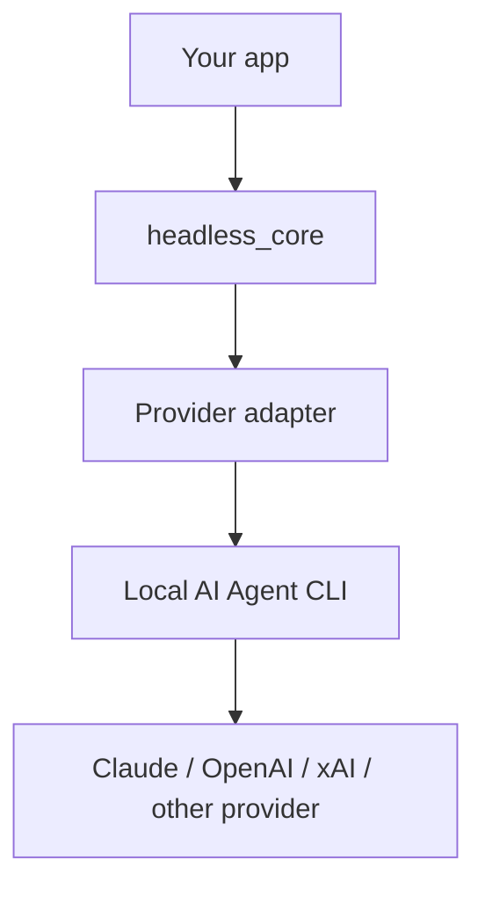

# headless_core

A core library for running AI Agent CLIs in headless mode from Node.js.

It allows you to run local CLIs such as Claude Code, Codex, Grok, and Agy using the same `run()` API, progress events, fallback hooks, and model selection mechanisms.

## Features

- CLI execution for Claude Code / Codex / Grok / Agy
- TypeScript API
- Progress notifications for intermediate `stdout` / `stderr` outputs via `onProgress`
- Cancellation using `timeoutMs` and `AbortSignal`
- Provider-specific model and reasoning effort option conversion
- Failure classification and fallback hooks
- Model candidate management via a shared `models.json` file
- `headless-core models init|inspect` CLI

## Demo

A minimal chat UI sample is provided.

```sh
npm run example
```

After starting, open it in your browser.

```txt
http://127.0.0.1:4173
```

For details, please refer to [example/README.md](./example/README.md).

## Installation

```sh
npm install @headless-core/core
```

To try it with local development:

```sh
npm install
npm run build
```

## Quick Start

```ts
import { createHeadlessCore } from "@headless-core/core";

const headless = createHeadlessCore({
  cwd: process.cwd(),
  timeoutMs: 120_000
});

const output = await headless.run({
  agent: {
    provider: "codex",
    model: "default",
    reasoningEffort: "medium"
  },
  prompt: "Say hello in one line."
});

console.log(output);
```

Execution example:

```txt
Hello.
```

If `model: "default"` is specified, the `--model` option is not passed to the provider CLI.

## How It Works



`headless_core` is not an API proxy. It runs the AI Agent CLI located in the user's local environment via `spawn`, and handles its output and exit status.

## API

### `createHeadlessCore(config?)`

```ts
const headless = createHeadlessCore({
  cwd: "/path/to/project",
  timeoutMs: 120_000,
  env: process.env
});
```

### `headless.run(options)`

```ts
const output = await headless.run({
  agent: { provider: "claude", model: "opus", reasoningEffort: "high" },
  prompt: "Summarize this project.",
  onProgress(event) {
    console.log(event.state, event.partialOutput ?? event.message);
  },
  onFallback({ error, prompt }) {
    if (error.kind === "rate_limit") {
      return {
        type: "rerun",
        agent: { provider: "codex", model: "default" },
        prompt
      };
    }

    return { type: "fail" };
  }
});
```

### `getAvailableModels(options)`

```ts
import { getAvailableModels } from "@headless-core/core";

const models = await getAvailableModels({ agent: "codex" });
```

### `getAvailableReasoningEffortOptions(options)`

```ts
import { getAvailableReasoningEffortOptions } from "@headless-core/core";

const efforts = getAvailableReasoningEffortOptions({ agent: "claude" });
```

## Options

### `createHeadlessCore`

| option | description |
| --- | --- |
| `cwd` | Working directory where the Agent CLI is executed |
| `timeoutMs` | Default execution timeout. Defaults to 120 seconds if not specified |
| `env` | Environment variables passed to the Agent CLI |

### `run`

| option | description |
| --- | --- |
| `agent.provider` | `codex`, `claude`, `grok`, `agy` |
| `agent.model` | Model ID passed to the provider. If `default`, `--model` is not passed |
| `agent.reasoningEffort` | Reasoning effort passed to the provider. If `default`, it is not passed |
| `prompt` | Instructions passed to the Agent CLI |
| `onProgress` | Callback for state changes and intermediate output |
| `onFallback` | Fallback callback on failure |
| `signal` | `AbortSignal` to abort execution |
| `timeoutMs` | Timeout specific to this execution |

## Supported Agents

| agent | binary | model option | reasoning effort |
| --- | --- | --- | --- |
| Codex | `codex` or `CODEX_BIN` | `--model` | `--config model_reasoning_effort="..."` |
| Claude Code | `claude` or `CLAUDE_BIN` | `--model` | `--effort` |
| Grok | `grok` or `GROK_BIN` | `--model` | Not supported |
| Agy | `agy` or `AGY_BIN` | `--model` | Not supported |

## Models Config

Model candidates are read from a shared configuration file:

```txt
~/.config/headless-core/models.json
```

To use a different path:

```sh
HEADLESS_CORE_MODELS_PATH=./example/models.json npm run example
```

Initialization:

```sh
headless-core models init
```

Inspect candidates in the current environment:

```sh
headless-core models inspect
```

`inspect` outputs JSON to stdout. It does not overwrite the configuration file.

## CLI

```sh
headless-core models init
headless-core models inspect
```

## Examples

- [example/README.md](./example/README.md): Minimal chat UI with a model selector
- [example/app.js](./example/app.js): Browser-side UI
- [example/server.mjs](./example/server.mjs): Execution example from a Node.js server
- [example/models.sample.json](./example/models.sample.json): Models config sample

## Requirements

- Node.js 20+
- The corresponding Agent CLI must be installed in the local environment
- macOS / Linux recommended
- Windows is not verified

## Limitations

- Does not include conversation history management, database persistence, or a Web API server
- Automatic retries are not performed. Implement in `onFallback` if needed
- Provider-specific authentication, billing, and rate limits depend on the settings of each CLI
- The Agent CLI may read and write local files
- The prompt, intermediate output, final result, and error details may remain in the application log

## Security

`headless_core` runs local AI Agent CLIs. For production use, consider the following:

- Restrict `cwd` to the minimum necessary directory
- Do not include secrets, API keys, or personal information in prompts or logs
- If untrusted input is included in prompts, treat it assuming prompt injection is possible
- For tasks involving file modifications, save the state (e.g., using Git) before execution
- Define post-processing after timeout, abort, or fallback on the application side

## Development

```sh
npm install
npm run build
npm test
```

To run all checks:

```sh
npm run check
```

## Project Structure

```txt
src/      TypeScript source
test/     Vitest tests
example/  Local demo app
docs/     Design notes and references
```

## License

MIT. See [LICENSE](./LICENSE).
