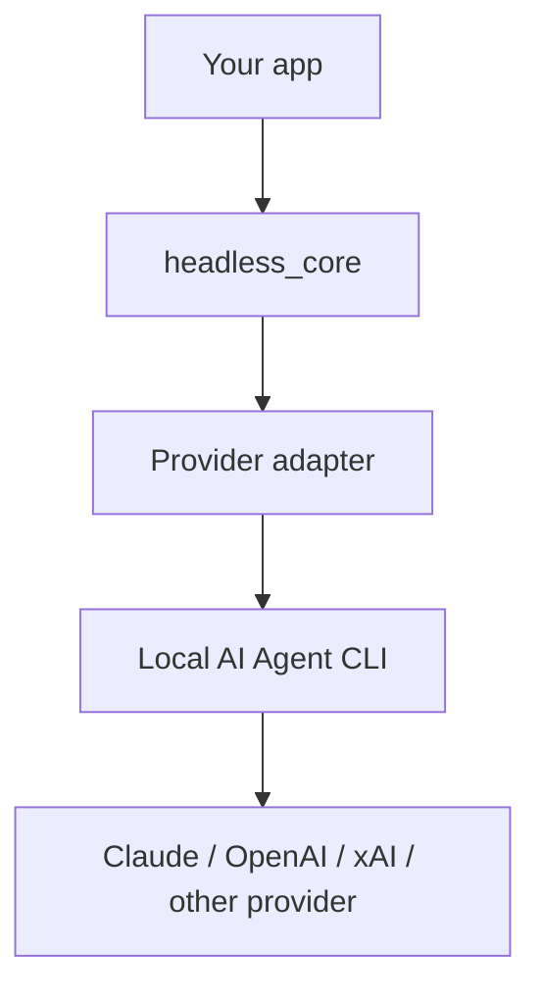

# headless_core

A core library for running AI Agent CLIs in headless mode from Node.js.

It allows you to run local CLIs such as Claude Code, Codex, Grok, Agy, and Devin using the same `run()` API, progress events, fallback hooks, and model selection mechanisms.

## Features

- CLI execution for Claude Code / Codex / Grok / Agy / Devin
- TypeScript API
- Progress notifications for intermediate `stdout` / `stderr` outputs via `onProgress`
- Cancellation using `timeoutMs` and `AbortSignal`
- Provider-specific model and reasoning effort option conversion
- Failure classification and fallback hooks
- Model candidate management via a shared `models.json` file
- `headless-core models init|inspect` CLI

## Demo

A minimal chat UI sample is provided.

```sh
npm run example
```

After starting, open it in your browser.

```txt
http://127.0.0.1:4173
```

You can override the address with the `PORT` / `HOST` environment variables. If the port is already in use, the next ports are tried automatically (up to 20).

For details, please refer to [example/README.md](./example/README.md).

## Installation

Install the package from npm: [@headless-core/core](https://www.npmjs.com/package/@headless-core/core)

```sh
npm install @headless-core/core
```

To try it with local development:

```sh
npm install
npm run build
```

## Quick Start

```ts
import { createHeadlessCore } from "@headless-core/core";

const headless = createHeadlessCore({
  cwd: process.cwd(),
  timeoutMs: 120_000
});

const output = await headless.run({
  agent: {
    provider: "codex",
    model: "default",
    reasoningEffort: "medium"
  },
  prompt: "Say hello in one line."
});

console.log(output);
```

Execution example:

```txt
Hello.
```

If `model: "default"` is specified, the `--model` option is not passed to the provider CLI.

## How It Works


```mermaid
flowchart TD
  App[Your app] --> SDK[headless_core]
  SDK --> Adapter[Provider adapter]
  Adapter --> CLI[Local AI Agent CLI]
  CLI --> Provider[Claude / OpenAI / xAI / other provider]
```

`headless_core` is not an API proxy. It runs the AI Agent CLI located in the user's local environment via `spawn`, and handles its output and exit status.

## API

### `createHeadlessCore(config?)`

```ts
const headless = createHeadlessCore({
  cwd: "/path/to/project",
  timeoutMs: 120_000,
  env: process.env
});
```

### `headless.run(options)`

```ts
const output = await headless.run({
  agent: { provider: "claude", model: "opus", reasoningEffort: "high" },
  prompt: "Summarize this project.",
  onProgress(event) {
    console.log(event.state, event.partialOutput ?? event.message);
  },
  onFallback({ error, prompt }) {
    if (error.kind === "rate_limit") {
      return {
        type: "rerun",
        agent: { provider: "codex", model: "default" },
        prompt
      };
    }

    return { type: "fail" };
  }
});
```

### `getAvailableModels(options)`

```ts
import { getAvailableModels } from "@headless-core/core";

const models = await getAvailableModels({ agent: "codex" });
```

### `getAvailableReasoningEffortOptions(options)`

```ts
import { getAvailableReasoningEffortOptions } from "@headless-core/core";

const efforts = getAvailableReasoningEffortOptions({ agent: "claude" });
```

### `headless.createSession(options)`

```ts
const session = await headless.createSession({
  agent: { provider: "codex", transport: "app-server", model: "default" }
});
```

### `headless.shutdown()`

Closes all sessions and terminates every persistent agent process owned by this core.

## Persistent sessions

`run()` spawns a fresh CLI process per call (transport `cli`, the default). For lower latency and conversation continuity, `createSession()` keeps a persistent agent process alive and reuses it across `session.run()` calls:

| provider | `transport` | persistent process |
| --- | --- | --- |
| `codex` | `app-server` | `codex app-server` (JSON-RPC over stdio) |
| `agy` | `acp` | `agy_acp_server` (Agent Client Protocol over stdio) |
| `devin` | `acp` | `devin acp` (Agent Client Protocol over stdio) |
| any | `cli` (default) | one-shot spawn per `run()` |

Sessions that share the same provider/transport/binary share one OS process; each session owns its own conversation (a codex thread or an ACP session). Concurrent `run()` calls on the same session are serialized; different sessions run in parallel. The process exits when the last session closes.

```ts
const session = await headless.createSession({
  agent: { provider: "codex", transport: "app-server" }
});

await session.run({
  prompt: "Hello",
  onProgress(event) {
    console.log(event.state, event.partialOutput);
  }
});
await session.run({ prompt: "Follow-up on the same thread" });

// New conversation, same process:
await session.reset();

// Dynamic model list / switching without restarting the process:
const models = await session.getAvailableModels();
await session.setModel("MODEL_ID", "low");

await session.close();

// Devin and Agy use the same API over ACP (`devin acp` / `agy_acp_server`):
const devin = await headless.createSession({
  agent: { provider: "devin", transport: "acp" }
});
await devin.run({ prompt: "Hello" });
await devin.close();

const agy = await headless.createSession({
  agent: { provider: "agy", transport: "acp" }
});
await agy.run({ prompt: "Hello" });
await agy.close();

// Kill every persistent process owned by this core:
await headless.shutdown();
```

`session.run()` accepts `prompt`, `signal` (`AbortSignal`), `timeoutMs`, and `onProgress` — the same progress events as `headless.run()`. Abort and timeout cancel the remote turn (`turn/interrupt` / `session/cancel`), so the session stays reusable. The headless permission posture matches each provider's CLI path: codex threads run with `sandbox: "read-only"` and `approvalPolicy: "never"` (approval requests are declined automatically), devin sessions select the answer-only `ask` mode with permission requests denied by default, and agy sessions select the most capable advertised mode (`accept-edits`, `auto_edit`, or `yolo` — the names differ per server build) and auto-approve permission requests (matching `agy --print --dangerously-skip-permissions`).

The agy `acp` transport spawns the standalone `agy_acp_server` binary (the `antigravity-acp` ACP registry entry), not the `agy` CLI. It is resolved from `AGY_ACP_BIN`, or `agy_acp_server` / `agy_acp_server.par` on `PATH` (`agy_acp_server.exe` on Windows). Models and reasoning effort are applied through the session's ACP config options: a level-embedded variant id (`gemini-3-8-flash-low`) is selected when advertised, and in-range levels otherwise go to the session's effort option (`effort`, `thought_level`, ...).

#### Installing `agy_acp_server`

The `acp` transport needs the official Google Antigravity ACP server, which is distributed through the [ACP registry](https://github.com/agentclientprotocol/registry/blob/main/antigravity-acp/agent.json) (registry id `antigravity-acp`; binary `agy_acp_server.par`, or `agy_acp_server.exe` on Windows). Check the registry for the latest version and the download URL for your platform — the walkthrough below follows the [setup wiki](https://github.com/taiyop/headless_core/wiki/Antigravity-ACP-Server-(agy_acp_server)-%E3%81%AE%E3%82%BB%E3%83%83%E3%83%88%E3%82%A2%E3%83%83%E3%83%97):

```sh
mkdir -p ~/.local/share/antigravity-acp && cd ~/.local/share/antigravity-acp
uname -m   # arm64 (Apple Silicon) or x86_64 (Intel)
curl -L -o agy-acp.zip \
  https://dl.google.com/agy-extensions/releases/macos/agy-acp-server-1.2.1-darwin-arm64.zip
# Intel Macs: use ...-darwin-x86_64.zip; see the registry for Linux/Windows builds
unzip agy-acp.zip && chmod +x agy_acp_server.par
xattr -cr ~/.local/share/antigravity-acp   # only if Gatekeeper blocks execution
```

Then either export `AGY_ACP_BIN=~/.local/share/antigravity-acp/agy_acp_server.par`, or put it on `PATH` via a symlink:

```sh
mkdir -p ~/.local/bin
ln -s ~/.local/share/antigravity-acp/agy_acp_server.par ~/.local/bin/agy_acp_server
```

The server authenticates with your Google account using the Antigravity credentials under `~/.gemini/` (shared with the Antigravity app / `agy` CLI). Sign in there first — once credentials exist, `initialize`/`session/new` work without an interactive flow.

For devin ACP sessions the `model` config option advertises variant uids that embed the thinking level (`swe-2-high`, `claude-opus-5-5-medium`), while `models.json` typically holds family slugs (`swe-2`, `claude-opus-5.5`). `setModel()`/session creation resolve them in this order: the effort-folded uid (`claude-opus-5.5` + `high` -> `claude-opus-5-5-high`), the exact or dashed id, then the family's only advertised variant (`swe-2` -> `swe-2-high`, `gpt-6-astra` -> `gpt-6-astra-medium`). Any remaining effort is applied via the `thought_level` config option when the session offers it. Passing `default` restores the model/thought level the session started with.

## Reasoning effort

`agent.reasoningEffort` accepts a shared vocabulary across providers:

```ts
type Effort = "default" | "none" | "minimal" | "low" | "medium" | "high" | "xhigh" | "max";
```

The values are **not** interchangeable aliases:

- `default` — do not send an explicit effort; the provider/CLI/model default applies. Omitting `reasoningEffort` behaves identically.
- `none` — fully disable reasoning/thinking. Distinct from `minimal`; it is only honored when the model exposes a real off switch (an advertised `none` level or a non-thinking variant). It is never silently converted to `minimal`/`low`.
- `minimal` — the smallest level that still runs reasoning, not "off".
- `low`/`medium`/`high`/`xhigh`/`max` — increasing effort as supported.

Each adapter maps a level to the provider's native mechanism and validates it against model capabilities **before** the request is sent (capability data comes from the runtime where available — `codex debug models`, the app-server `model/list`, `devin models list`, ACP config options, `agy models`). Unsupported values raise an `EffortError`:

- `INVALID_EFFORT` — the value is outside the vocabulary (e.g. `"banana"`).
- `UNSUPPORTED_EFFORT` — valid value, but the selected model cannot express it. The error message lists the model's supported efforts; no implicit fallback is applied.

Per-provider mapping:

| provider | mechanism | notes |
| --- | --- | --- |
| Codex | `model_reasoning_effort` (CLI `-c` / app-server `turn/start` `effort`) | Levels pass through verbatim. Per-model support is enforced from `supported_reasoning_levels` / `supportedReasoningEfforts`. `default` omits the parameter |
| Claude Code | `--effort` | Accepts `low`, `medium`, `high`, `xhigh`, `max` |
| Grok | `--effort` | Accepts `low`, `medium`, `high` |
| Agy (Gemini-family) | level-embedded variant ids (`--model gemini-3-8-flash-low`) or `--effort` | A variant carrying the requested level wins; `none` maps only to an explicit non-thinking variant (`gemini-2-5-flash-none`), never to `minimal`; remaining in-range levels use `--effort low|medium|high` |
| Devin | variant uids (`--model <model>-<level>`) or ACP `thought_level` | `none` maps only to an explicit non-reasoning variant (`gpt-5-4-none`, or the family's level-less sibling among thinking variants) — never to a mechanical `<model>-none`. Other levels must match an advertised variant or `thought_level` |

When capability data cannot be fetched, codex/agy degrade to provider-side validation; devin `none` is always rejected without a catalog since only an advertised variant may carry it.

### Transport-specific capabilities (devin)

Devin capabilities are read per transport, and they do not always agree:

- `cli` — `devin models list` advertises every variant uid, including non-thinking variants (`gpt-6-luna-none`, `gpt-5-4-none`).
- `acp` — the session's `model` config option advertises a **curated subset** (e.g. only `gpt-6-luna-medium`), and `session/set_config_option` rejects values outside that list (`Invalid value ... for config option 'model'`).

So an effort can be supported on `cli` while unsupported on `acp`: `gpt-6-luna` + `none` resolves to `gpt-6-luna-none` on `cli`, but on `acp` it fails with `UNSUPPORTED_EFFORT` because the session never offered that variant. `supportedEfforts` in the error always reflects the selected transport's actual options.

## Options

### `createHeadlessCore`

| option | description |
| --- | --- |
| `cwd` | Working directory where the Agent CLI is executed |
| `timeoutMs` | Default execution timeout. Defaults to 120 seconds if not specified |
| `env` | Environment variables passed to the Agent CLI |

### `run`

| option | description |
| --- | --- |
| `agent.provider` | `codex`, `claude`, `grok`, `agy`, `devin` |
| `agent.transport` | `cli` (default), `app-server` (codex), `acp` (agy, devin). See Persistent sessions |
| `agent.model` | Model ID passed to the provider. If `default`, `--model` is not passed |
| `agent.reasoningEffort` | Shared effort vocabulary (`default`, `none`, `minimal`, `low`, `medium`, `high`, `xhigh`, `max`). `default`/omitted sends no effort; unsupported values raise `EffortError`. See Reasoning effort |
| `prompt` | Instructions passed to the Agent CLI |
| `onProgress` | Callback for state changes and intermediate output |
| `onFallback` | Fallback callback on failure |
| `signal` | `AbortSignal` to abort execution |
| `timeoutMs` | Timeout specific to this execution |

## Supported Agents

| agent | binary | model option | reasoning effort |
| --- | --- | --- | --- |
| Codex | `codex` or `CODEX_BIN` | `--model` | `--config model_reasoning_effort="..."` |
| Claude Code | `claude` or `CLAUDE_BIN` | `--model` | `--effort` |
| Grok | `grok` or `GROK_BIN` | `--model` | `--effort` |
| Agy | `agy` or `AGY_BIN` (cli); `agy_acp_server` or `AGY_ACP_BIN` (acp) | `--model` | Level-embedded variant ids win (`gemini-3-8-flash-low`); otherwise `--effort low|medium|high` (cli) or the ACP effort config option (acp). `none` requires an advertised non-thinking variant |
| Devin | `devin` or `DEVIN_BIN` | `--model` | Folded into the model uid: `model` + effort becomes `--model <model>-<effort>` (e.g. `claude-opus-5` + `high` -> `claude-opus-5-high`). Requires an explicit model; only advertised variants are used — `none` maps to an explicit non-reasoning variant or fails |

### Headless tool / permission notes

| agent | Headless behavior |
| --- | --- |
| Codex | `--sandbox read-only` (no file writes) |
| Claude Code | `--tools ""` (no tools; text-in/text-out only) |
| Agy | `--dangerously-skip-permissions` and `--mode accept-edits` so non-interactive `--print` can run tools and write files (e.g. image generation). `--print-timeout` matches the run `timeoutMs`. If a tool is still auto-denied, Agy may exit 0 with an empty stdout and a stderr notice; that is treated as a failed run. The `acp` transport keeps the same posture: sessions select an edit-capable mode (`accept-edits`/`auto_edit`/`yolo`) and `session/request_permission` is auto-approved. |
| Grok | No special sandbox flags |
| Devin | `--print --respect-workspace-trust false --permission-mode auto` (read-only tools auto-approved; no file writes). The prompt is passed after `--` |

## Models Config

Model candidates are read from a shared configuration file:

```txt
~/.config/headless-core/models.json
```

To use a different path:

```sh
HEADLESS_CORE_MODELS_PATH=./example/models.json npm run example
```

Initialization:

```sh
headless-core models init
```

Inspect candidates in the current environment:

```sh
headless-core models inspect
```

`inspect` outputs JSON to stdout. It does not overwrite the configuration file.

## CLI

```sh
headless-core models init
headless-core models inspect
```

To run the CLI from a source checkout, build first and invoke `dist/cli.js` (the `headless-core` bin points to it):

```sh
npm run build                          # required: the bin entry points to dist/cli.js
node dist/cli.js models inspect        # inspects all providers and prints JSON to stdout
```

## Examples

- [example/README.md](./example/README.md): Minimal chat UI with a model selector
- [example/app.js](./example/app.js): Browser-side UI
- [example/server.mjs](./example/server.mjs): Execution example from a Node.js server
- [example/models.sample.json](./example/models.sample.json): Models config sample

## Requirements

- Node.js 20+
- The corresponding Agent CLI must be installed in the local environment
- For the agy `acp` transport: the official `agy_acp_server` binary (see [Installing `agy_acp_server`](#installing-agy_acp_server))
- macOS / Linux recommended
- Windows is not verified

## Limitations

- Does not include database persistence or a Web API server; session conversations live only inside the running agent process and are dropped on `reset()`/`close()`/process exit
- Automatic retries are not performed. Implement in `onFallback` if needed
- Provider-specific authentication, billing, and rate limits depend on the settings of each CLI
- The Agent CLI may read and write local files
- The prompt, intermediate output, final result, and error details may remain in the application log

## Security

`headless_core` runs local AI Agent CLIs. For production use, consider the following:

- Restrict `cwd` to the minimum necessary directory
- Do not include secrets, API keys, or personal information in prompts or logs
- If untrusted input is included in prompts, treat it assuming prompt injection is possible
- For tasks involving file modifications, save the state (e.g., using Git) before execution
- Define post-processing after timeout, abort, or fallback on the application side

## Development

```sh
npm install
npm run build
npm test
```

To run all checks:

```sh
npm run check
```

## Project Structure

```txt
src/      TypeScript source
test/     Vitest tests
example/  Local demo app
docs/     Design notes and references
```

## License

MIT. See [LICENSE](./LICENSE).
